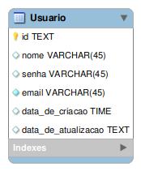

<h1 align="center">
    SIMPOCOMP2023-introducao-back-end-node
</h1>

<p align="center">
  <a href="https://github.com/byPedroCruzDev/SIMPOCOMP2023-cadastro-de-usuarios/blob/main/LICENSE">
    
  </a>
</p>

O SIMPOCOMP2023-introducao-back-end-node é uma aplicação que sera utilizada no minicurso de introdução ao javascipt 
## 📄 Tabela do banco de dados

<p align="center">

</p>

## 🛠️ Tecnologias
- [JavaScript](https://developer.mozilla.org/pt-BR/docs/Web/JavaScript)
- [Git](https://git-scm.com/)
- [Eslint](https://eslint.org/)

## ✔️ Pré Requisitos
- [Git](https://git-scm.com/book/en/v2/Getting-Started-Installing-Git)
- [Node.js](https://nodejs.org/en/)
- [ExpressJs]([https://nodejs.org/en/](https://expressjs.com/pt-br/starter/installing.html))

## 🚀 Como executar

Clone o repositório
```
git clone https://github.com/byPedroCruzDev/SIMPOCOMP2023-cadastro-de-usuarios.git
```
Instale as dependências
```
npm i
```
Execute
```
npm run start 
```
## 📝 License
Esse projeto está sob a licença MIT. Veja o arquivo [LICENSE](LICENSE) para mais detalhes.

## Autor
 |  [<br><sub>Pedro Cruz</sub>](https://www.linkedin.com/in/bypedrocruzdev/) | [<br><sub>Gabriel Oliveira</sub>](https://www.linkedin.com/in/gabriel-dos-santos-oliveira-24b67b243/)
| :---: |  :---: | 

